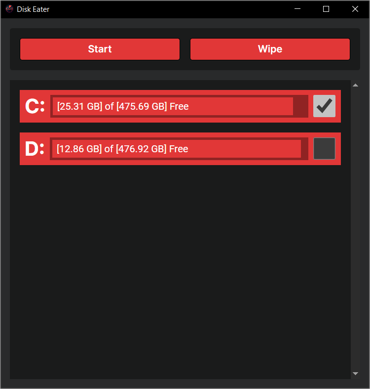

<h1 style="display: flex; align-items: center;">
    
    Disk Eater
</h1>

<b>Simple Tauri app for filling the disk space with random data.</b>

### Features
- Live disk space monitoring.
- Dynamic scaling to fill the disk up to its last byte.

### Current State
- The `Wipe` button does nothing.
- Requires admin privileges to fill system disk.
- Supports Windows only.

### Usage
1. Run the app.
2. Wait for it to get the system info.
3. Select disks from the list you want to fill up.
4. Click `Start` button.

This will create a random file at `<DISK>:/DiskEater` with random data.

### Screenshot

